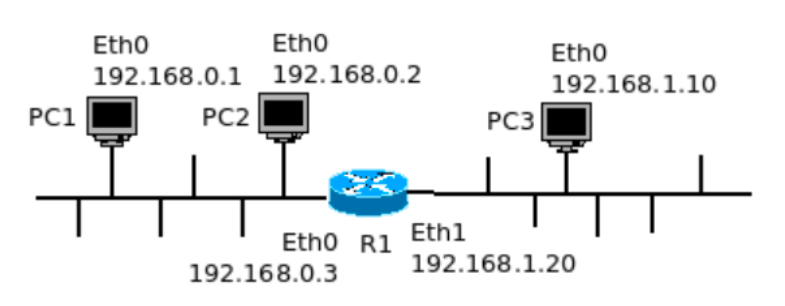
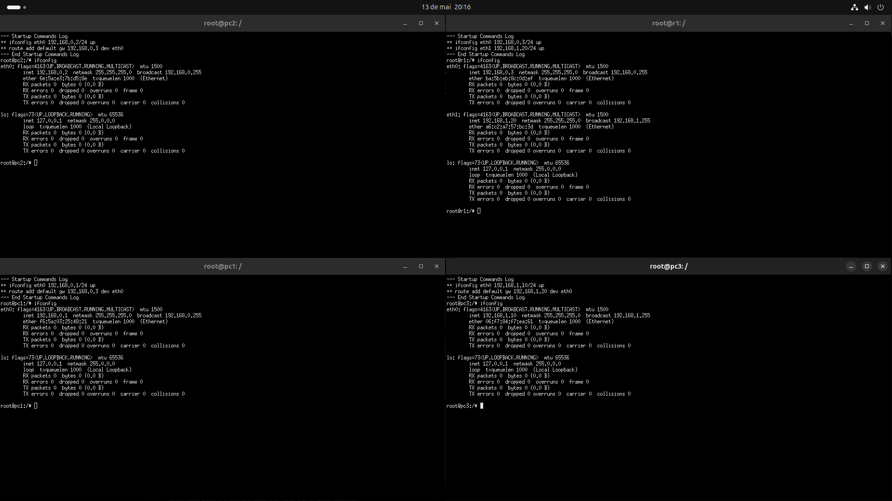
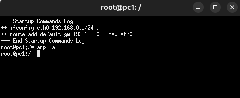
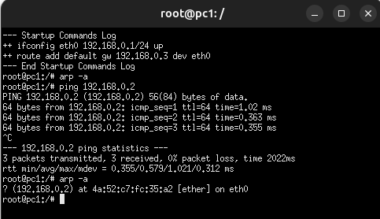
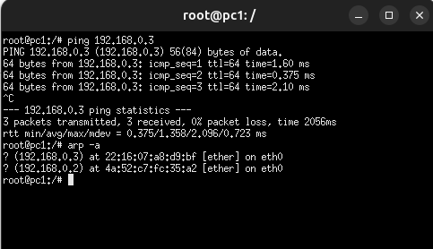
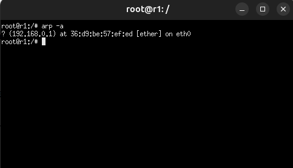
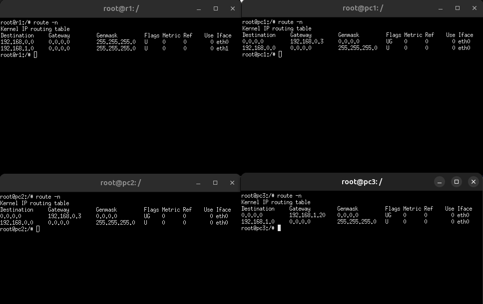

# Atividade 02 - Criação de rede com scripts

Para esse laboratório, utilizaremos o software Kathará, que se utiliza do container Docker.

**Crie a configuração de rede definida no exemplo abaixo:**



Contendo dois domínios de colisão: A (pc1 e pc2) e B (pc3) e um roteador interligando os domínios A e B (r1).
Para isso use scripts de inicialização e o comando kathara lstart.

* Crie uma pasta para a criação dos scripts de inicialização, por exemplo, lab1.2

```shell
mkdir lab1.2
cd lab1.2
```

* Dentro da pasta lab1.2, crie os seguintes arquivos e pastas:

```
lab1.2/
├── lab.conf
├── pc1.startup
├── pc2.startup
├── pc3.startup
├── r1.startup
├── pc1/
├── pc2/
├── pc3/
└── r1/
```

## Conteudo de cada arquivo:

**lab.conf**
```shell
  pc1[0]=A
  pc2[0]=A
  r1[0]=A
  r1[1]=B
  pc3[0]=B
```

**pc1.startup**
```shell
ifconfig eth0 192.168.0.1/24 up
route add default gw 192.168.0.3 dev eth0
```

**pc2.startup**
```shell
ifconfig eth0 192.168.0.2/24 up
route add default gw 192.168.0.3 dev eth0
```

**pc3.startup**
```shell
ifconfig eth0 192.168.1.10/24 up
route add default gw 192.168.1.20 dev eth0
```

**r1.startup**
```shell
ifconfig eth0 192.168.0.3/24 up
ifconfig eth1 192.168.1.20/24 up
```

## Inicie a rede do laboratório.

`kathara lstart`



1. Verifique a tabela arp no pc1, antes de iniciar qualquer comunicação
    * **arp:** Protocolo que mapeia o endereço IP para o endereço MAC
    * `arp -a` 



Inicialmente, nenhuma informação é mostrar por nao ter havido uma comunicação 

2. Ainda no pc1, teste a conectividade com o pc2 com o comando ping. Na sequência, verifique novamente a tabela arp no pc1.



Agora, o arp retorna o MAC do IP do pc2

3. Ainda no pc1, teste a conectividade com o pc3 com o comando ping. Na sequência, verifique novamente a tabela arp no pc1. Por que o IP do pc3 não aparece na tabela arp do pc1?



**R:** Porque o pc1 não se comunica diretamente com o pc3, que esta em outra rede, ou seja, o pc1 se comunica com o r1, que por sua vez se comunica com o pc3. Como resultado o IP e o MAC salvos serão do r1, que foi como quem o pc1 se comunicou.

4. Verifique a tabela arp no roteador r1.



Mostra o endereço do pc1

5. Verifique a tabela de roteamento em todos os dispositivos.
    * `route -n`
    


