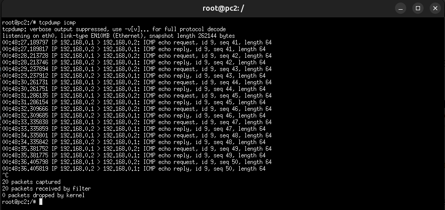
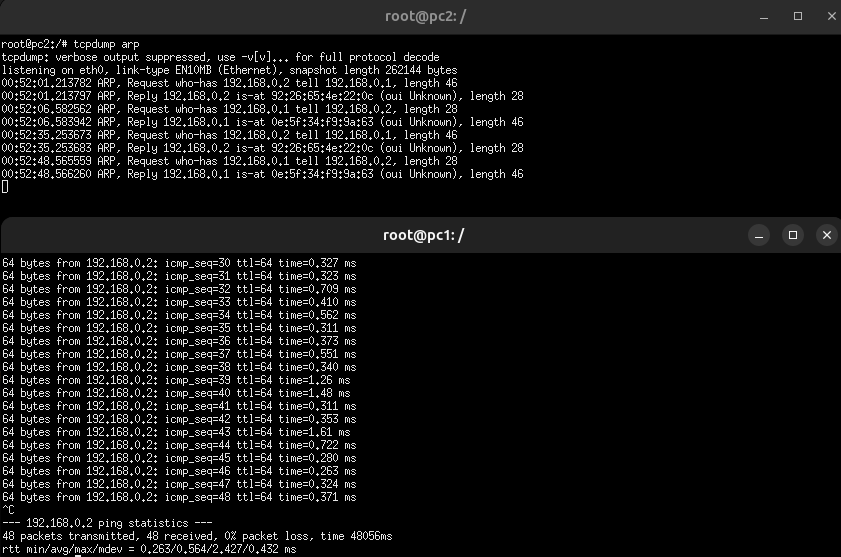

# Atividade 03 - Captura de pacotes

1. Reinicie o teste de conectividade do pc1 com o pc2 (no pc1, dispare o comando ping para o endereço do pc2).  Enquanto o teste de conectividade com o ping do pc1 para o pc2 continua acontecendo, execute a captura de pacotes no pc2 em formato texto
 	
`tcpdump icmp`

Copie e comando e o resultado da captura de pelo menos 5 pacotes.



2. Reinicie a rede para limpar as tabelas arp.

``` shell
kathara lclean
kathara lstart
```

No pc2, inicie a captura de pacotes arp
`tcpdump arp`

Enquanto a captura de tráfego continua acontecendo, execute o teste de conectividade entre o pc1 e o pc2, a partir do pc1, com o comando ping. 

Copie o comando e o resultado da captura de pelo menos 5 pacotes.



