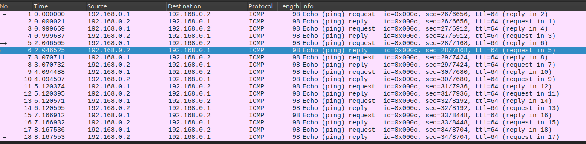
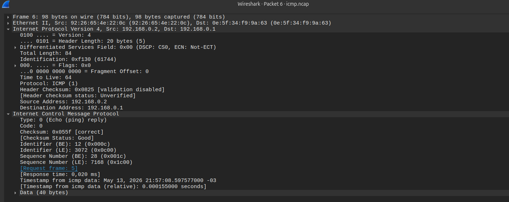

# Atividade 4 - Captura e análise de cabeçalho IP

Capture os pacotes salvando em um arquivo no host, e na sequência analise com o wireshark o conteúdo capturado.

Não é necessário copiar esse resultado para o arquivo texto.

`tcpdump icmp -e -i eth0 -w /hosthome/icmp.ncap`

Parâmetros do tcpdump:
* icmp: captura somente pacotes icmp
	- e: mostra o endereço físico do enlace
	- i eth0: captura somente da interface eth0
	- w /hosthome/icmp.ncap: grava o resultado no arquivo informado, para análise pelo wireshark

Para abrir o arquivo com o Wireshark, dê um duplo click no arquivo icmp.ncap, dentro da pasta HOME do seu usuário.

1. Escolha um pacote icmp capturado, do tipo Echo reply, examine o cabeçalho IP do pacote, identificando os campos.

Qual o valor do campo TTL (Time To Live)?

**R:** 64

Há algum flag setado? Se sim, qual(is)?

**R:** Não

2. Para o mesmo pacote capturado, examine o cabeçalho ICMP.
Qual o valor do tempo decorrido entre a transmissão do pacote de teste e a resposta?

**R:** 0,020 ms